# 1

<!doctype> 声明必须位于 HTML5 文档中的第一行,使用非常简单:

<meta charset="utf-8">
表示文档的编码格式为utf-8
<title> 这里面写的是网页的名称（网页标签）  </title>

HTML 标题

通过<h1>-<h6>标签来定义

HTML段落 通过标签<p>来定义

HTML链接通过标签<a>来定义

test

><!DOCTYPE html>
><html>
>	<head>
>		<meta charset="utf-8">
>		<title>test1</title>
>	</head>
>	<body>
>		<p><h1>hello world</h1></p>
>		<p>我是一个段落</p>
>		<a href="https://www.bing.com">bing</a>
>	</body>
></html>
>
>

```html

```


> <!DOCTYPE html>
> <html>
> 	<head>
> 		<meta charset="utf-8">
> 		<title>馨美公司装修介绍</title>
> 	</head>
> 	<body>
> 		<h2>公司介绍</h2>
> 		<hr>
> 		<p style="font-size: 18px;text-align: center;">人民对美好生活的向往，是我们奋斗的目标，在这里，创业的氛围让我们每个人都积极创新，为作出美好的事情而努力。</p>
> 		<hr>
> 	</body>
> </html>

其中标题元素h2

水平线元素hr

段落元素p

>css样式
>
><p style="font-size: 18px;text-align: center;">
>    style 样式 
>    font-size  字体大小
>   text-align 对齐方式
></p>
>
>
>​    
>
>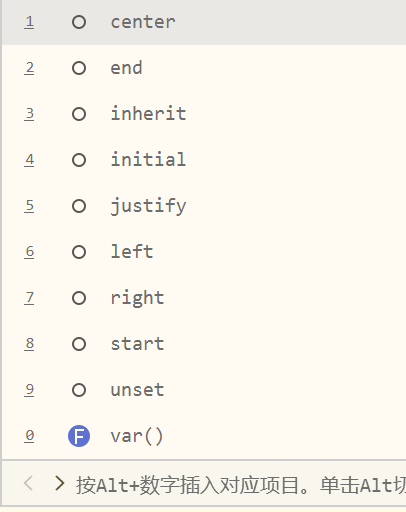

><!DOCTYPE html>
><html>
>	<head>
>		<meta charset="utf-8">
>		<title>HTML 5 保留的文本格式元素示例</title>
>	</head>
>	<body>
>		<p><b>粗体文本</b><big>大号文本<big><big>更大号字体</big><b><big>粗更大号字体</big></b></big> </p>
>		<p><i>倾斜文本</i><small>小号字体</small><small><small>更小号字体</small></small><i><small>倾斜小号字体</small></i></p>
>		<p><tt>打字机或者等宽的文本</tt>这段包含<sup>上标</sup>还包括<sub>下标</sub></p>
>	</body>
></html>


[HTML 元素参考 - HTML（超文本标记语言） | MDN (mozilla.org)](https://developer.mozilla.org/zh-CN/docs/Web/HTML/Element)


<b>加粗</b>

<big>大号字体</big>

<i>倾斜</i>

<sub>下标</sub>

<sup>上标</sup>

<cite>斜体表示引用</cite>


<br><br>


<h3>hello</h3>

<blockquote>hello</blockquote>


<hr>

### 元信息元素

用于描述文件自身信息的一类元素，meta元素定义原信息，包含页面的描述、关键字、最后的修改信息等

<meta>标签写在<head>----</head>标签中

meta元素常用属性

- charset:定义文件的字符编码，常用的是utf-8
- content:定义与name和http-equrv相关的原信息
- name:关联content的名称常用的有keyword关键字、author作者名description页面描述


### 语义元素

**语义元素是指清楚的向浏览器和开发者描述其意义的元素**

有100多个HTML语义元素可分为

- 块级元素
- 行内（内联）元素
- 行内块元素
- 。。。。。


#### 块级元素 block

display:block元素

1、独占一行

2、直接控制宽度（width）高度（height） 盒子模型的相关CSS属性，内边距（padding）外边距（margin）等都可控制

3、在不设置宽度的情况下 块级的元素是其父级元素的内容宽度

4、在不设置高度的情况下块级元素的高度是其本身内容的高度

#### 行内元素 inline

display:line元素

------------------


#### 元素

<br > 是换行元素

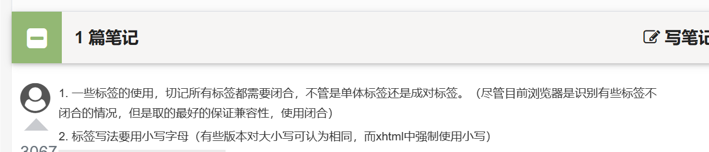


### 注释

<!-- 我是注释 -->


### 特殊符号

采用&xxx;方式代表一个符号

实体符号

[HTML特殊符号（字符实体)大全_html特殊符号代码_折耳鼠的博客-CSDN博客](https://blog.csdn.net/wxl2454497677/article/details/107608884)


><p>
>   123     &nbsp;123   &nbsp;&nbsp;&nbsp;        0
></p>

输入连续空格浏览器只识别一个空格，若要多个空格则使用多个<!-- &nbsp; -->


></img>
>
>


<hr>

**超链接元素**

<a href = "https://developer.mozilla.org/zh-CN/docs/Web/HTML/Element/img" target = "blank">img属性</a>


<video src = "https://www.bilibili.com/video/BV1t94y1W7TP/?spm_id_from=333.1007.0.0"></video>


<iframe src="//player.bilibili.com/player.html?aid=363373637&bvid=BV1t94y1W7TP&cid=1262251633&p=1" scrolling="no" border="0" frameborder="no" framespacing="0" allowfullscreen="true"> </iframe>


**img元素**

>abc</img>

**src**


><a href="#">hello</a>《to top》<a href = "">hhhhh</a>
>
><a href = "javascript:void(0);">zzzzzz</a>  《执行JavaScript函数》


#### 列表元素

#### 无序列表 ul

><ul>
>    <h2>324242424</h2>
>    <li>1</li>
>    <li>2</li>
>    <li>3</li>
>    <li>4</li>
>    <li>5</li>
>    <li>6</li>
>    <li>7</li>
>    <li>8</li>
>    <li>9</li>
>    <ul>
>        <h3>11111</h3>
>        <li>0000</li>
>    </ul>
></ul>
>
><b>自动缩进</b>

<h4>有序列表 ol li</h4>

><ol>
>    <h6>000000</h6>
>    <li>11</li>
>    <li>22</li>
>    <li>33</li>
>    <li>44</li>
>    <li>55</li>
>    <ol>
>        <h7>--------</h7>
>        <li>000000</li>
>        <li>099990</li>
>        <li>00222</li>
>    </ol>
></ol>
>
>自动添加序号


<h4>定义列表  dt dd</h4>

<dl>
    <dt>title one</dt>
    <dd>i am a title one </dd>
    <dt>title 2</dt>
    <dd>i am a title 2 </dd>
    <dt>title 3</dt>
    <dd>i am a title 3 </dd>
</dl>


**嵌套列表同理**


### **iframe 框架元素**

<p>
    <iframe src = "http://www.bing.com" name = "bilibili" width = "1024" height="512"></iframe>
    <a href = "http://www.bilibili.com" target = "mainFrame"> bilibili</a><br>
    <iframe name = "mainFrame" width = "800" height = "800"></iframe>
</p>


可以在网页中插入其他的网页

<b>属性</b>

<ul>
    <li>src:引用的页面地址</li>
    <li>name设置框架的标识</li>
    <li>width:设置框架的宽度</li>
    <li>height:设置框架的高度</li>
</ul>

部分网页可以进行内联部分网站限制不可


### 分区元素 div

<div id= "id" class = "类名">
    将HTML元素分为一块一块
</div>


<div class = "page">
    <h2>hello</h2>
    <div class = "hander">
        <p>
            <h2>
                title
        </h2>
        </p>
    </div>
<div class = "nav">
                First&nbsp;&nbsp;Secand&nbsp;&nbsp;Third&nbsp;&nbsp;Fourth

</div>
<hr>
<hr>
</div>

<div><b>中的类名可以 随便写主要是代码的可读性</b>
</div>


### 范围元素span

<span style = "text-align:center">span标签是HTML中的一种内联元素，通常用于组合文档中的一小部分内容，并且不会导致文本换行。</span>


## HTML 文档结构布局


- header: 页眉
- nav:导航
- article:文档页面应用程序网站中的一体化内容
- section:文档的一段一节
- aside:页面内容有关有别于主要内容
- footer:页脚
- hgroup：代表段或者节的标题
- time:代表时间
- mark：文档中需突出显示的文字

实例

```html
<!DOCTYPE html>
<html>
	<head>
		<meta charset="utf-8">
		<title>hello jy</title>
	</head>
	<body>
		<header><h1>我是header 页眉</h1></header>
		<nav>我是nav 导航栏
		<ul>
			<li><a href="#">主页</a></li>
			<li><a href="#">副页</a></li>
			<li><a href="http://www.baidu.com">baidu</a></li>
		</ul>
		<form>
			<input type="search" name="se" placeholder="要搜索的内容">
			<input type="submit" name="tj" value="search">
		</form>
		
		</nav>
		<main>
			<text style="color: aquamarine;">我是文本</text>
			<H3>我是king</H3>
			
			<aside>我是aside 侧边栏
			<h2>url</h2>
			</aside>
		</main>

		<footer>
			我是footer 页脚
			<p>© 2050 某某保留所有权利</p>
		</footer>
	</body>
</html>
```


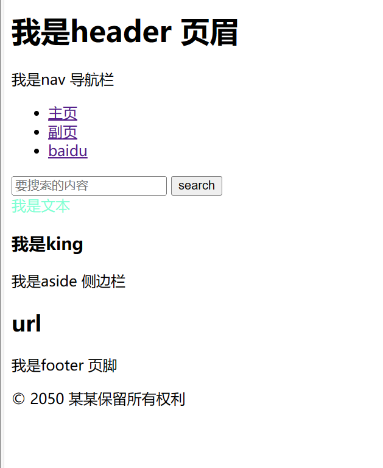


学习css样式的时候再进一步


### HTML  交互元素

```html
	<details>
	<summary>hello</summary><!-- 指定标题   -->
	<ul>
		<li>list1</li>
		<li>list2</li>
	</ul>
	</details>
```
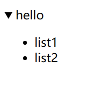


### HTML   progress元素

- value 已经完成的工作量
- max    总共有多少工作量

value和max的值都必须大于0

val 的值必须小于max

> <p>
> 	<progress max="100" value="90"></progress>
> </p>


### HTML  表格


> <table border="2" cellspacing = "60	" cellpadding = "20"><!-- border="2" -->
>		<caption>Caption biaoti 行为tr列为td 加粗为td</caption>
>		<tr><th>First</th><th> Secand</th><th> Third</th></tr>
>		<tr><td>00</td><td>01</td><td>09</td></tr>
>		<tr><td>03</td><td>04</td><td>10</td></tr>	
> </table>


>cellpadding和cellspacing是HTML表格中使用的属性，用于控制表格单元格的样式和布局。
>
>cellpadding是指单元格边框到内容之间的距离（留白），通常以像素为单位进行设置。例如，如果您设置cellpadding为10像素，那么单元格边框与内容之间的空白距离为10像素。
>
>而cellspacing是指单元格之间的空白量，也就是表格中各个单元格之间的距离，同样通常以像素为单位进行设置。通过调整cellspacing可以改变表格中单元格之间的间距，从而影响整个表格的外观和布局。
>
>需要注意的是，HTML规范中已经不建议使用cellspacing和cellpadding属性，因为它们已经被CSS样式所取代。在现代的网页开发中，建议使用CSS来设置表格的样式和布局，包括单元格间距和填充等。
>
>

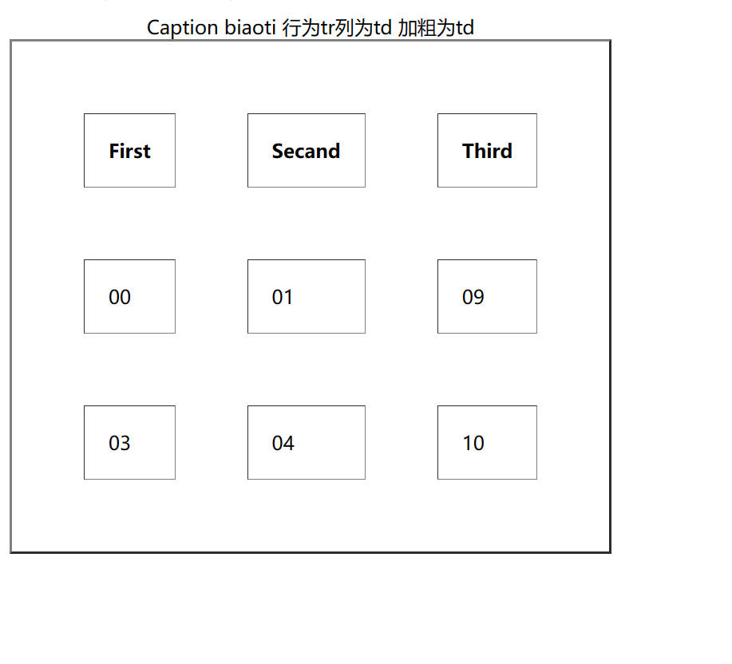

### 不规范表格

colspan用于表格的跨行  横着跨  colspan = 2

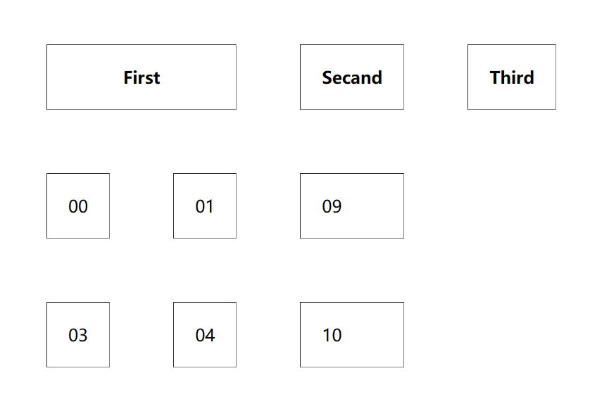

rowspan用于表格的跨列  竖着跨 rowspan = 2 竖着跨

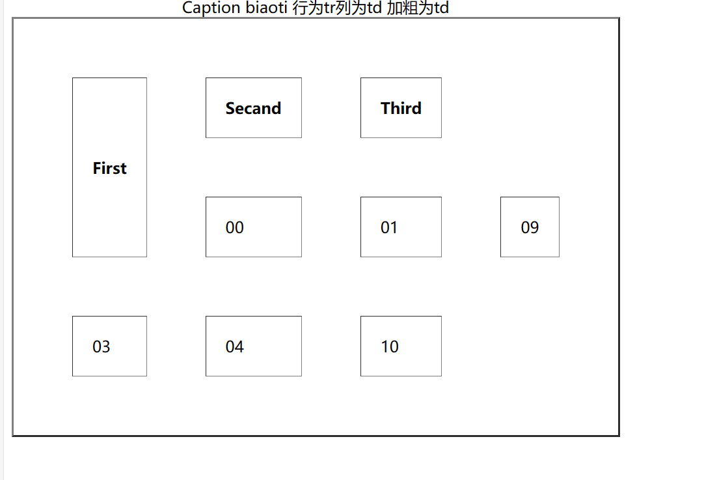


- thead
- tbody
- tfooter

出现一个必须全部出现


>		<table border="2" cellspacing = "60	" cellpadding = "20" style="background-color: black;"><!-- border="2" -->
>			<caption>Caption biaoti 行为tr列为td 加粗为td</caption>
>			<thead style="background-color: aqua;">
>				<tr><th>First</th><th> Secand</th><th> Third</th></tr>
>			</thead>
>		<tbody style="background: #F300f0;">
>													
>							<tr><td>00</td><td>01</td><td>09</td></tr>
>				<tr><td>03</td><td>04</td><td>10</td></tr>
>													
>						</tbody>	
>												
>					<tfoot style="background: #00FF00;">
>			<tr><td colspan="3" style="text-align: center;">end</td></tr>
>		</tfoot>
>												
>						</table>


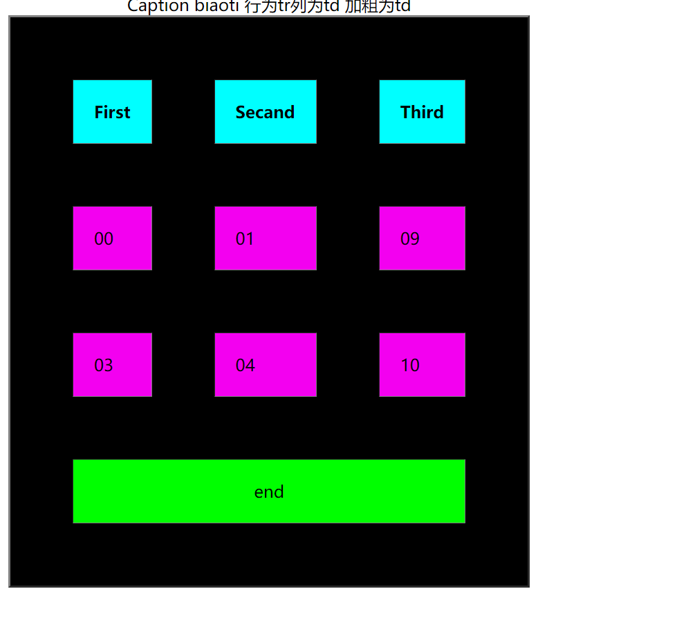

```html
			<colgroup>
				<col width = "100" style="background: #F38090;">
				<col width = "500" style="background: #5500ff;">
				<col width ="300" style="background: #ffaaff;" >
			</colgroup>
<!--  使用colgrop 和 col进行格式化   -->
```


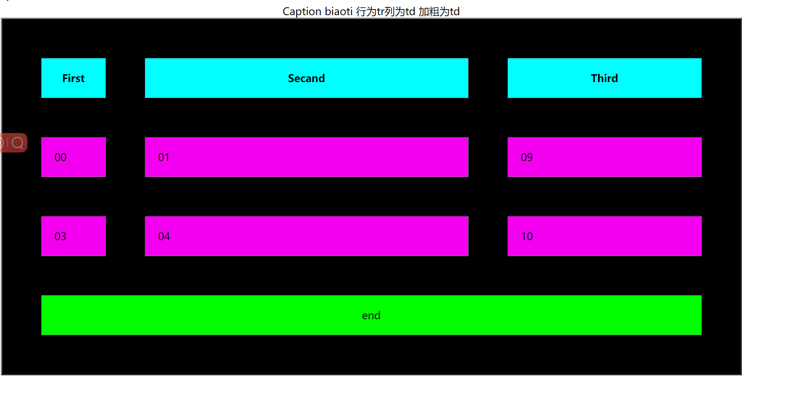


### 表单元素 Form


> **<form name= "表单名" action="URL" method="get|post">**使用方法

- name属性：表单的名字，在一个网页中唯一识别一个表单，和id属性相同 **该属性必有**
- method 属性：规定用于发送表单数据时的发送模型，其属性是get或post **该属性必有**
- action属性：规定在提交表单数据时向何处发送表单数据 网址或者email**该属性必有**


### 输入元素input

<input>元素用来定义用户数据输入字段 

><input type = "表项类型" name="表项名" value = "默认值" size = "x" maxlength= "y">123</input>


><iframe src = "https://www.runoob.com/tags/att-input-type.html" widht = "200" height = "600">
></iframe>


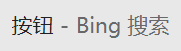

>```html
><!DOCTYPE html>
><html>
>	<head>
>		<meta charset="utf-8">
>		<title>hello jy</title>
>		<!--  -->
>		
>	</head>
>	<body>
>		<h3>login</h3>
>		<br><hr>
>		<p>
>			<form action="" method="">
>				<Table>
>					<tr><td>账号 <input type="text" value="" name="uid" size="12" maxlength="12"></td></tr>
>					<tr><td>密码<input type="password" value="" name="password" size="12" maxlength="12"></td></tr>
>					<tr><td><p>性别:<input type="radio" value="male"  name="sex" checked = "checked"><b>male</b> <input type="radio" value="female" name = "sex"><b>female</b></p></td></tr>
>					<tr><td>爱好：<input type="checkbox" name="aihao" value="a" checked="checked">java
>								<input type="checkbox" name="aihao" value=b">html
>								<input type="checkbox" name="aihao" value="c">C++
>					</td></tr>
>					<tr><td>颜色：<input type="color" name="color" id="color" value="#00FF00"></td></tr>
>					<tr><td>日期：<input type="date" name="DATe" id="date"></td></tr>
>					<tr><td>日期时间：<input type="datetime-local" name="datetime" id="datetime"></td></tr>
>					<tr><td>年龄：<input type="number" name="age" id="age" value="10"></td></tr>
>					<tr><td>工作月份：<input type="range" value="18" max="36" min="6" id="month"></td></tr>
>					<tr><td>博客地址：<input type="url" id="url" placeholder="你的博客地址"></td></tr>
>					<tr><td><input type="reset">&nbsp;&nbsp;
>							<input type="submit" id="submit">&nbsp;&nbsp;
>							<input type="reset" value="自定义按钮"> &nbsp;&nbsp; 
>							<input type="image" name="image" id="image" src = "C:\Users\14130\Desktop\HTML5\xxbj.assets\image-20231015103846812.png" 
>							 
>							 width="80" height="25" />
>							<br>
>					</td></tr>
>					
>					
>				
>					
>					</Table>
>				
>				
>			</form>
>			
>		</p>
>		
>		
>	</body>
></html>
>
>```


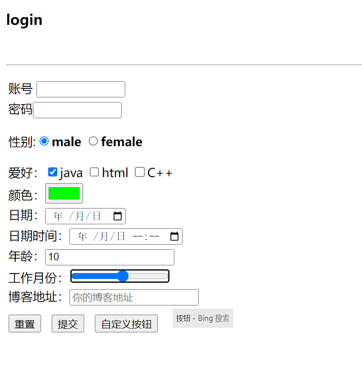

input元素需要在同1个表按钮单才会起作用


### 标签元素Label

**语法**

> <label for= "id">说明文字</label>

for属性用于关联另一个属性值

```html
	<form action="" method="">
		<label for="uname"> 账号：</label><input type="text" id="uname" name="user" placeholder="请输入username">
		<br>
		<label for="password">密码：</label><input type="password" name="password" id="password" placeholder="please input password">
	</form>
```


### 选择栏元素select

**select 语法格式**

select 元素 必须配合 option optgroup元素使用  有 size属性是组合框 没有是列表框

><form action="">
>	<!-- multiple = "multiple" 表示是否可以用户选择多项  size代表显示在列表中的选项数目-->
>	<br>
>	<select size = "3" name="控制操作名"  >
>		<optgroup label="number">
>			<option value="1" >first</option>
>			<option value="2">secand</option>
>			<option value="3">third</option>
>			<option value="4">fourth</option>
>			<option value="5">fifth</option>
>			<option value="6">sixth</option>
>			<option value="7" selected = "selected">seventh</option>
>			<option value="8">eigth</option>
>		</optgroup>
>    </select>
></form>
><form action="">
>	<!-- multiple = "multiple" 表示是否可以用户选择多项  size代表显示在列表中的选项数目-->
>	<br>
>	<select name="控制操作名"  >
>		<optgroup label="number">
>			<option value="1" >first</option>
>			<option value="2">secand</option>
>			<option value="3">third</option>
>			<option value="4">fourth</option>
>			<option value="5">fifth</option>
>			<option value="6">sixth</option>
>			<option value="7" selected = "selected">seventh</option>
>			<option value="8">eigth</option>
>		</optgroup>
></select>


### 多行文本元素 textarea

**语法格式**

<textarea name = "文本域名" rows = "行数" cols  ="列数">
text dafault
</textarea>

- name: name
- cols: 设置textsarea 文本区的宽度 此属性必须设置
- rows:指定testarea文本区的可见高度 此属性必须设置
- maxlength: 指定文本的最大个数
- readonly:指定文本区为只读 属性值为readonly
- required:指定文本区为非空 只能为required


### 表单分组 

常见的分组元素

fieldset & legend

表单常见的分组格式

><form>
>    	<form>
>		<fieldset>
>			<legend>分组标题</legend>
>        </fieldset>
>    </form>
> </form>
>
>

>
>
><form>
>		<fieldset>
>			<legend>请选择你的个人爱好</legend>
>			<input type="checkbox" name="like" id="音乐" value="音乐">音乐
>			<input type="checkbox" name="like" id="上网" value="上网">上网
>			<input type="checkbox" name="like" id="足球" value="足球">足球
>			<input type="checkbox" name="like" id="下棋" value="下棋" checked = "checked">下棋
>		</fieldset>
></form>
>
>


>
><form>
>		<fieldset>
>			<legend>请选择个人课程选修情况</legend>
>			<input type="checkbox" name="choice" id="computer" value="computer">computer <br>
>			<input type="checkbox" name="choice" id="math" value="math">math <br>
>			<input type="checkbox" name="choice" id="java" value="java">java <br>
>			<input type="checkbox" name="choice" id="c++" value="c++" checked = "checked">c++ <br>
>		</fieldset>
>	    </form>


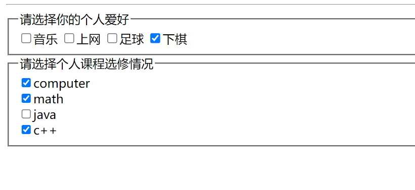


代码实现的矢量元素

##### need   SVG教程


>```html
>	<svg widht = "300" height = "300">
>			
>		<rect widht = "100%" height = "100%" fill = "black">
>			
>		</rect>
>		<circle cx = "150" cy="150" r="90" fill="#00FF00">
>		</circle>
>	</svg>
>```


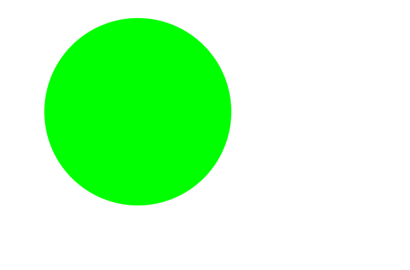


